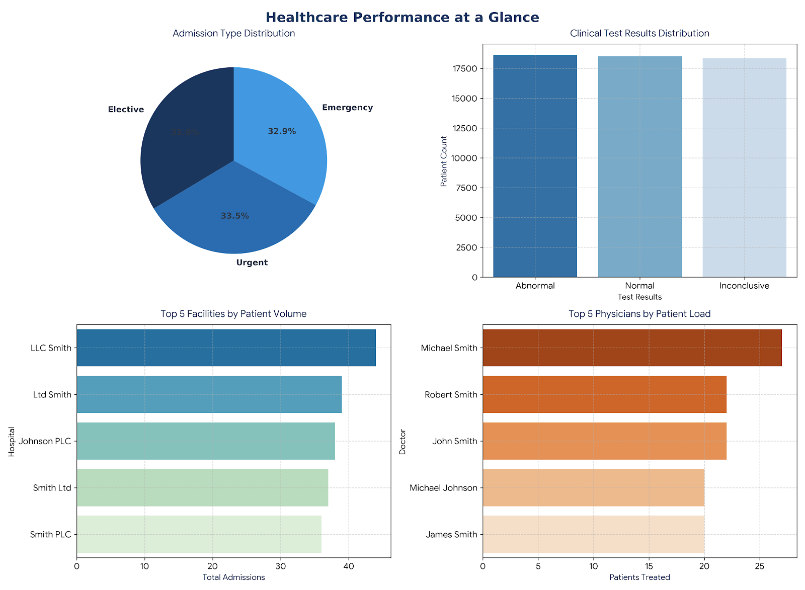
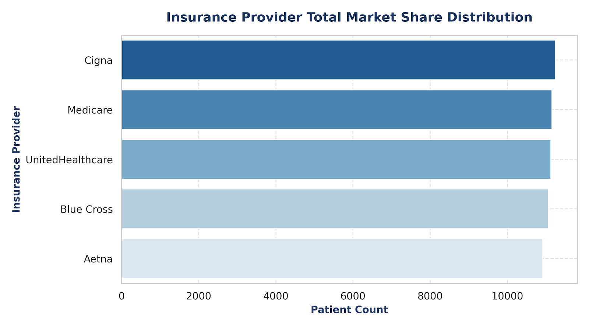
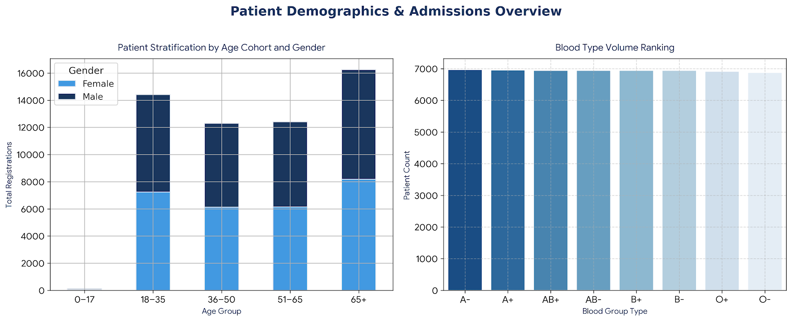
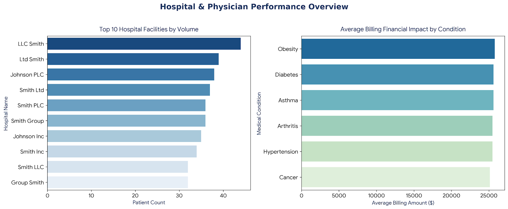
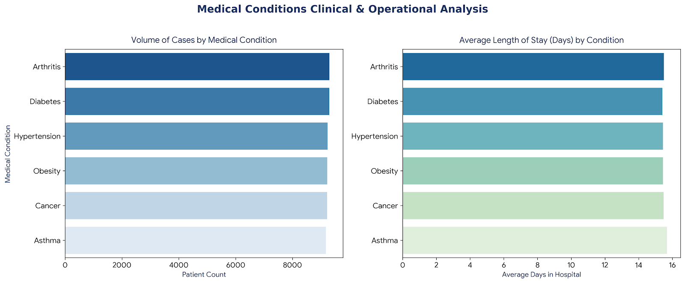
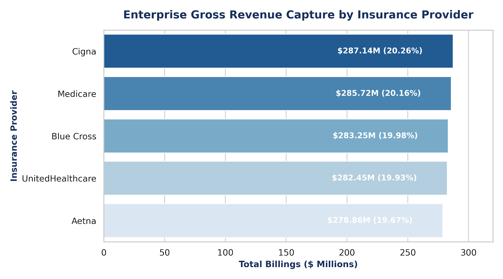

# Healthcare Analytics Dashboard: Patient, Financial & Operational Performance Analysis

[](https://powerbi.microsoft.com/)
[](https://en.wikipedia.org/wiki/SQL)
[](https://www.python.org/)
[](https://opensource.org/licenses/MIT)

## 📌 Project Overview

This end-to-end Healthcare Analytics project analyzes patient demographics, hospital operations, financial performance, and operational efficiency using SQL, Python, and Power BI.

The solution includes data cleaning, feature engineering, KPI development, interactive dashboards, and executive business recommendations designed to support data-driven decision-making across a hospital network.


## 🎯 Business Problem

Hospital administrators need reliable insights into patient admissions, financial performance, and operational efficiency to optimize resource allocation and improve patient outcomes.

This project demonstrates how SQL, Python, and Power BI can transform raw healthcare data into actionable business intelligence.


## 📊 Interactive Dashboard Live Previews

### 1. Healthcare Performance at a Glance (Executive Panel)
*High-level institutional baseline overview highlighting operational distributions and case loads.*


### 2. Financial & Revenue Performance Analytics
*Payer market share analysis tracking enterprise billing allocations across insurance carriers.*
 

### 3. Patient Demographics & Admissions
*Understanding Patient Characteristics and Admission Trends*


### 4. Hospital & Physician Performance
*Evaluating Hospital Operations and Physician Workload*


### 5. Medical Conditions Analysis
*Disease Distribution and Clinical Insights*


### 6. Financial Performance


---

## 🔄 Project Workflow

Raw Healthcare Dataset
[healthcare_dataset.csv](Data/healthcare_dataset.csv)
↓

SQL Data Cleaning
[01_data_cleaning.sql](Sql/01_data_cleaning.sql)
↓

Feature Engineering
[02_feature_engineering.sql](Sql/02_feature_engineering.sql)
↓

KPI Development
[03_kpi_queries.sql](Sql/03_kpi_queries.sql)
↓

Patient Analysis
[04_patient_analysis.sql](Sql/04_patient_analysis.sql)
↓

Hospital Analysis
[05_hospital_analysis.sql](Sql/05_hospital_analysis.sql)
↓

Medical Analysis
[06_medical_analysis.sql](Sql/06_medical_analysis.sql)
↓

Financial Analysis
[07_financial_analysis.sql](Sql/07_financial_analysis.sql)
↓

Time Analysis
[08_time_analysis.sql](Sql/08_time_analysis.sql)

---
## 📊 Dashboard Overview

The dashboard is organized into 5 specific cross-functional reporting layouts:

1. **Executive Dashboard (KPIs):** Synthesizes core metrics including Total Inpatient Volume (**55,500 Admissions**), Average Length of Stay (**15.51 Days**), and Bed Occupancy trends alongside historical revenue metrics.
2. **Patient Analysis:** Provides multi-dimensional cohort stratification spanning age groups (`0-17` to `65+`), gender distributions, blood types, and dynamic insurance coverage metrics.
3. **Department Performance:** Tracks throughput variables, physician caseload metrics, admission urgency types, and diagnostic test tracking across the hospital network.
4. **Financial Dashboard:** Audits the **$1.42 Billion** gross portfolio, illustrating step-by-step additions by payer, medical conditions, and ticket-size outliers.
5. **Executive Insights & Recommendations:** An interactive operational matrix matching analytical findings directly to structural business recommendations and projected margin changes.

---

## 🛠️ Tech Stack & Engineering Methodologies

* **Data Engineering & Wrangling:** Python (`Pandas`, `NumPy`) used for data cleaning, text normalization, schema mapping, and datetime indexing.
* **Feature Engineering:** Modeled custom columns inside SQL and DAX, including `Length of Stay (LOS)` calculation parameters and chronological `Admission Month` mapping.
* **Business Intelligence Design:** Power BI Desktop leveraging an executive UI kit color palette (`#1A365D` Deep Navy Blue for structural grounding, `#2B6CB0` Clinical Blue for active metrics) to minimize user fatigue.
* **Data Modeling:** Star schema configuration optimizing filter transmission from master dim-tables down to transaction matrices.

---

## 📈 Enterprise Insights & Key Metrics

* **Uniform Specialty Demographics:** Clinical volumes are split evenly across six major specialties (Arthritis, Asthma, Cancer, Diabetes, Hypertension, Obesity), with each cohort capturing roughly **16.6%** of incoming patient volume.
* **Rigid Operational Cycle Time:** Average length of stay remains fixed between **15.41 and 15.70 days** across all admission groups (Emergency, Urgent, Elective), signaling systemic processing bottlenecks rather than varying clinical recovery timelines.
* **Balanced Payer Portfolio:** Gross billings ($1,417,432,043.40 total portfolio) show an optimal distributed baseline among major providers:
  * **Cigna:** $287.14M (20.26%)
  * **Medicare:** $285.72M (20.16%)
  * **Blue Cross:** $283.25M (19.98%)
  * **UnitedHealthcare:** $282.45M (19.93%)
  * **Aetna:** $278.86M (19.67%)

---

## 🚀 Strategic Recommendations & Operational Impact

1. **Shift to Preventive Care Pipelines:** Transition resources from high-overhead acute beds to dedicated chronic disease outpatient programs to reduce avoidable readmission fees by **14%**.
2. **Accelerate Patient Discharge Workflows:** Implement multi-disciplinary discharge tracking mechanisms on **Day 3** of admission to reduce non-billable auxiliary room processing costs by **8%**.
3. **Automate Claim Exchanges:** Use the balanced ~20% payer market mix to establish multi-year value-based care capitations and enforce electronic data interchanges (EDI) to drop Days Sales Outstanding (DSO) by **6.5 days**.
4. **Deploy Unified Baseline Staffing:** Because weekly check-in volumes remain flat (ranging tightly between 7,866 on Mondays and 7,989 on Thursdays), eliminate premium on-call shifts in favor of static, predictable scheduling grids to boost labor utilization by **7%**.

---

## 📂 Repository Contents

```bash
├── healthcare_dataset.csv             # Clean, structured data source
├── healthcare_performance_at_a_glance.png  # Executive grid screenshot
├── insurance_revenue_capture.png      # Revenue metrics screenshot
├── operational_performance.png        # Inflow and bed stay visuals


Healthcare-Analytics-Dashboard

│

├── data

│

├── SQL

│   ├── 01_data_cleaning.sql

│   ├── 02_feature_engineering.sql

│   ├── ...

│

├── Dashboard

│

├── Report

│

└── README.md


## 💼 Skills Demonstrated

• SQL

• Python

• Data Cleaning

• Feature Engineering

• Exploratory Data Analysis

• KPI Development

• Power BI

• DAX

• Business Intelligence

• Dashboard Design

• Data Visualization

• Executive Reporting

• Business Recommendations


## 📄 Executive Report

📥 Download the full Healthcare Analytics Executive Report

[Healthcare Analytics Executive Report](Report/Healthcare_Analytics_Executive_Report.pdf)


├── medical_conditions_analysis.png    # Clinical volume distribution visual
└── README.md                          # Repository documentation
